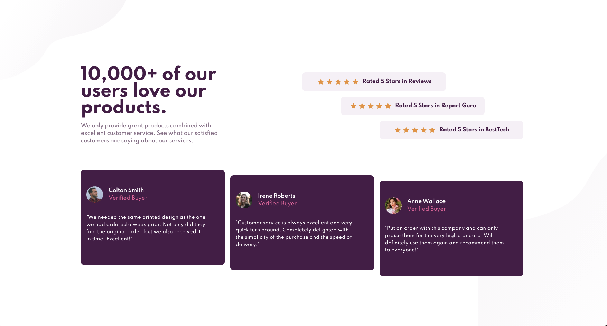

# Frontend Mentor - Social proof section solution

This is a solution to the [Social proof section challenge on Frontend Mentor](https://www.frontendmentor.io/challenges/social-proof-section-6e0qTv_bA). Frontend Mentor challenges help you improve your coding skills by building realistic projects.

## Table of contents

- [Overview](#overview)
  - [The challenge](#the-challenge)
  - [Screenshot](#screenshot)
  - [Links](#links)
- [My process](#my-process)
  - [Built with](#built-with)
  - [What I learned](#what-i-learned)
  - [Useful resources](#useful-resources)
- [Author](#author)

### The challenge

Users should be able to:

- View the optimal layout for the section depending on their device's screen size

### Screenshot

### Links

- Solution URL: [Add solution URL here](https://github.com/jchapar/social_proof_section)
- Live Site URL: [Add live site URL here](https://jchapar.github.io/social_proof_section/)

## My process

I started this project with a mobile first approach. I knew I would be using grid for the desktop version so I made sure to keep each section in their own containers. I used SASS partials to keep the styling of each component separate. This helped keep my styling more organized and easier to follow along.

### Built with

- Semantic HTML5 markup
- CSS custom properties
- Flexbox
- CSS Grid
- Mobile-first workflow
- SASS

### What I learned

I had to take a step back and review CSS Grid. Grid helped me set and place the different section in place for the desktop version.
In regards to SASS, I've really been enjoying using partial files for styling different sections and components of the challenge. It's been helping my keep things organized and clean.

### Useful resources

- [Example resource 1](https://www.youtube.com/watch?v=9zBsdzdE4sM&t=793s) - I watched this video by Web Dev Simplified to review and practice working with grid. It's a great resource for any new or experienced developer when a CSS Grid review is needed.

## Author

- Frontend Mentor - [@jchapar](https://www.frontendmentor.io/profile/jchapar)
- Twitter - [@j_chapar](https://www.twitter.com/j_chapar)
